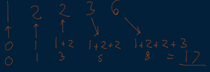
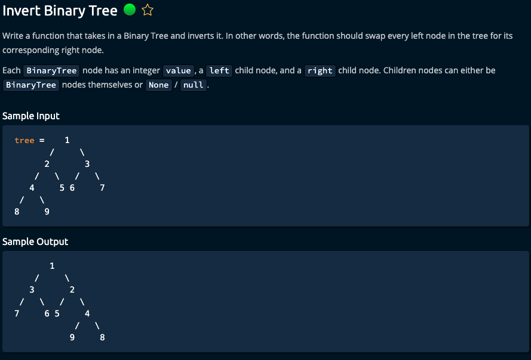
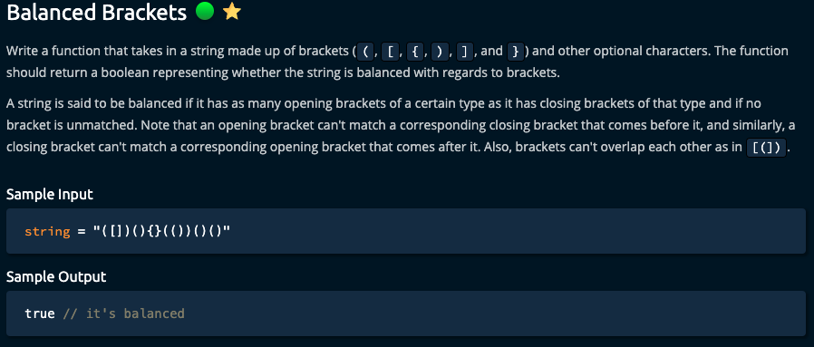

- [!! Minimum Waiting Time](#-minimum-waiting-time)
- [Middle Node](#middle-node)
  - [Double Pointer Solution](#double-pointer-solution)
  - [Run full count then half count solution](#run-full-count-then-half-count-solution)
- [Knuth-Morris-Pratt (KMP) Algorithm](#knuth-morris-pratt-kmp-algorithm)
  - [Conceptual Overview:](#conceptual-overview)
- [Generate Document](#generate-document)
  - [Solution 1 using while loop and substrings](#solution-1-using-while-loop-and-substrings)
  - [Solution 2 using a count Hash to compare letter quantities](#solution-2-using-a-count-hash-to-compare-letter-quantities)
  - [Solution 3 using recursion](#solution-3-using-recursion)
- [Invert Binary Tree](#invert-binary-tree)
- [Balanced Brackets](#balanced-brackets)
- [Points That Intersect With Cars](#points-that-intersect-with-cars)
- [Merge Intervals](#merge-intervals)
- [Rate Limiter](#rate-limiter)
- [Two Sum](#two-sum)


## !! Minimum Waiting Time
- You did not understand the problem
  - Needed to cover the base case where one ele would return waiting time of 0
  - Needed to pick the order so the total waiting time will be the least
  - You should have tried an array of only 2 items to see the pattern
- This is a "Greedy Algorithm" where we will always pick the shortest query to run next
- O(n log n) time bc the sort is (n log n) + n to iterate through and sum
- Process: Putting the highest durations at the very end would spare the other queries from having to wait for them
  - Note how every query is involved in the wait time of all the queries after it
  - 
  - Therefore, take each query and multiple by how many elements to the right of it, then sum to an initial sum of 0
- BEWARE: declaring variables instead of reassigning them!!!
- BEWARE: .sort requires a function that will return -, 0, or +. Negative will return a before b.

## Middle Node
- Javascript does NOT have until loop! Used `while` or `do...while` loop
  - [JS loops](https://www.freecodecamp.org/news/javascript-loops-explained-for-loop-for/)
    - "a `do...while`\` loop is guaranteed to run at least once, even if the condition expression already evaluates to true"
  - Use either var ++ OR var += 1
  - There is no .floor() function. It is Math.floor(num) or Math.ceil(num)
  - BEWARE: When you are checking your conditional, if it'll cut out the first or last iteration
    - This required the while loop to run THROUGH the node becoming null
  - You forgot to define midIdx in both conditionals
    - AND you misunderstood what index to return
  - Remember to ROUND the middle index or else it is a decimal
### Double Pointer Solution
- Move one pointer twice the speed of the slower pointer
- When fast pointer reaches the end of the list, slow pointer will be halfway through
  - End of the list means it has either exited (fastPointer === null) or it is the last node (fastPointer.next === null)
### Run full count then half count solution
- BEWARE: count starting at 0 or 1? What will be your end conditional?
  - What happens at step i in your loop?


## Knuth-Morris-Pratt (KMP) Algorithm
- UNSOLVED
- used to efficiently find whether a substring exists within a string
  - eg. DNA genome sequence
### [Conceptual Overview:](https://www.algoexpert.io/questions/knuth-morris-pratt-algorithm)
- Usual time complexity of double `for loops` to find substrings = `O(n*m)`
- KMP algorithm turns the time complexity to `O(n+m)`
  - Instead of restarting the first loop at the second letter and restarting the substring altogether, we can keep the last time we had found the last matching patterns
  - One pointer traverses foward the entire time
  - The other pointer jumps back only so much to the last pattern before it starts moving forward again with the other pointer
- s complexity: O(m) space where m = to the substring bc of the table we had made
- Steps:
- Part 1
  - Look at substring only first. Traverse the substring and create a list/array/table of patterns we see
    - 2 pointers and we are looking for when a prefix is also a suffix to the substring
    1) Compare inner letter to outer letter (index 1 to index 0)
       - equal ? outer index : -1, is added to the list
       - increment inner
       - Once they match, add the outer index to the array instead of -1 and then increment both
    2) If they don't match, then we look at outer - 1 if there is a pattern there
       - if not, then reset outer to 0 and continue the inner loop forward
    3) Restart at Step 1 again. Remember to keep the outer index if values at inner & outer match
    4) If they don't match, do step 2 again
      - See if in our table at outer - 1 if we had recorded a pattern
      - If so, then outer = that index we had recorded, increment, and then compare THAT letter to the current inner value
    5)  Restart at Step 1 again and repeat until inner loop exits the substring
- Part 2: 2 pointers, one in substring and second in big string
  - Pointer in the big string continues forward and does not reset
  1) If they match, increment both
  2) If they don't match:
    - Substring index - 1 to the last char that matched and check that index in the table if there was a pattern building
      - If there is a non (-1) reported index, the substring index goes back to that recorded index and then increments 1 to check the next letter against the current big string pointer
      - If the index is -1, then send substring index all the way back to the beginning of the string
    - Go back to Step 1 (note that we didn't have to send big string pointer all the way back)
  - Remember that the table means the recorded indicies leading up to that were both a suffix and a prefix at some point in time


## [Generate Document](generateDocument.js)
### Solution 1 using while loop and substrings
- BEWARE: What is the conditional for your while loop?
- t complexity = `O(n**2 * m)`
  - iterates thru characters, & each iteration includes character.slice = `n*n`
  - `* m`, bc within the loop, worst case also includes document.slice on each iteration
- s complexity = `O(m + n)` bc .slice is called on each string = copy is made of each
### Solution 2 using a count Hash to compare letter quantities
- Consider using the OR operator when dealing with undefined values
  - Evalutes to the first truthy value or the last value if all are falsy
  - Here, if value is undefined, left side will evaluate to NaN; will evaluate to right side
```
for (let x of characters) {
    characterCount[x] = ++characterCount[x] || 1;
}
```
- BEWARE: `for loops` for objects VS strings
  - use OF to define the KEY at each item 
  - use IN to define the INDEX at each item when iterating each index for 
  - **`for (let ele of string)` VS `for (let index IN string)`**
- t complexity = `O(n + m)`
  - Don't forget to keep a variable for each input
- s complexity = `O(c)` where c is the number of unique chars in characters string
### Solution 3 using recursion
- **N.B. .splice overwrites the original array!**
  - `array.splice(index, howmany items to remove, any, items, to, add)`
- **N.B. Splice is an ARRAY METHOD, not for strings!**

## Invert Binary Tree

- YOU MUST WORK ON THE ROOT NODE FIRST!
  - Wrap the root node in a queue and then start your queue loop
- Not sure how long I took because of this stupid stopwatch resetting 😅 

## Balanced Brackets

-   25mins, but I couldn't troubleshoot my solution, which was failing
    -   BEWARE THE LOGIC OF && vs ||
-   If you .pop an empty array, it returns undefined
-   Be careful the punctuation inside the set-up for a for loop

## Points That Intersect With Cars
- UNSOLVED

## Merge Intervals
- UNSOLVED

## Rate Limiter
- UNSOLVED

## Two Sum
- [ ] SOLVE in Python
  - [ ] DO IT WITH A HASH MAP in python
- [ ] Review double for loop
- [ ] CHALLENGE: what about using MAP WITH INDEX